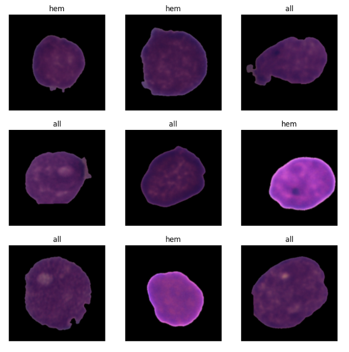
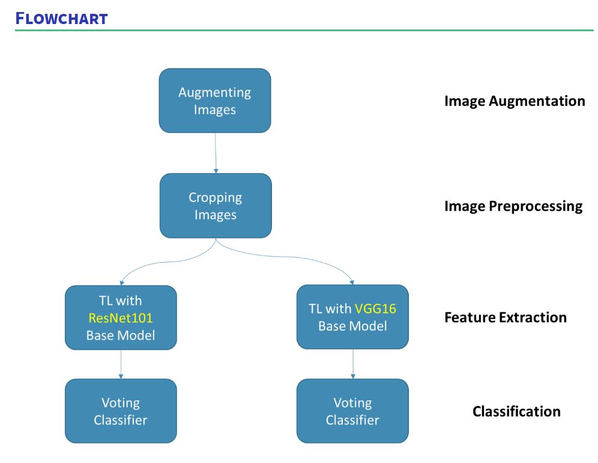
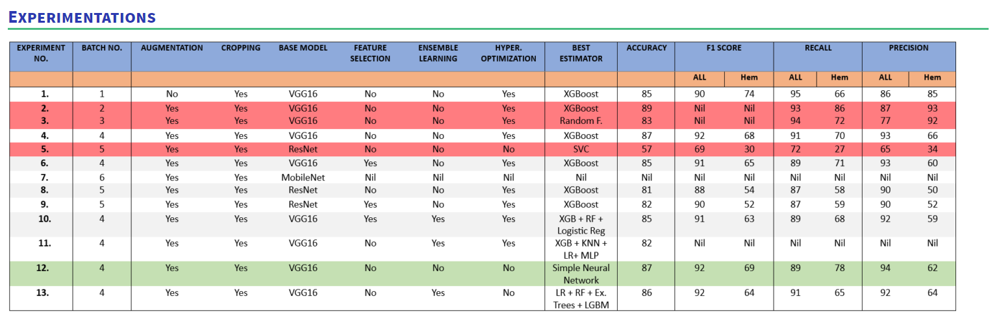
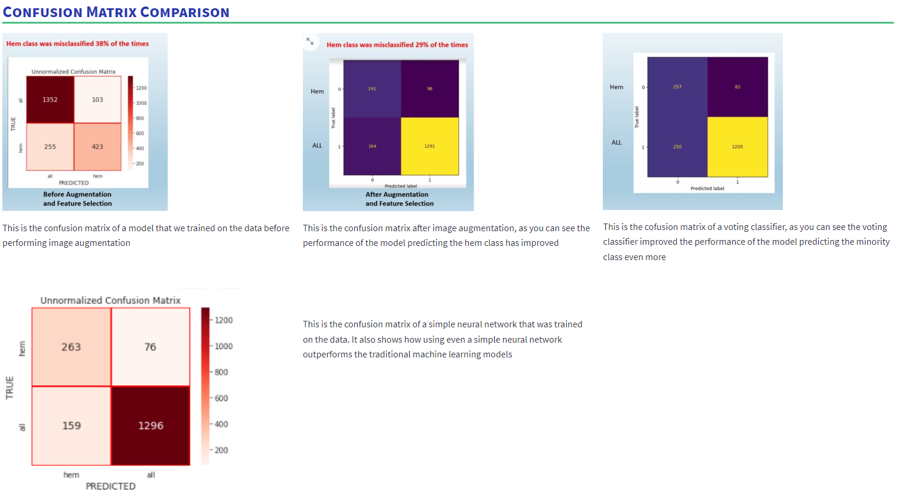
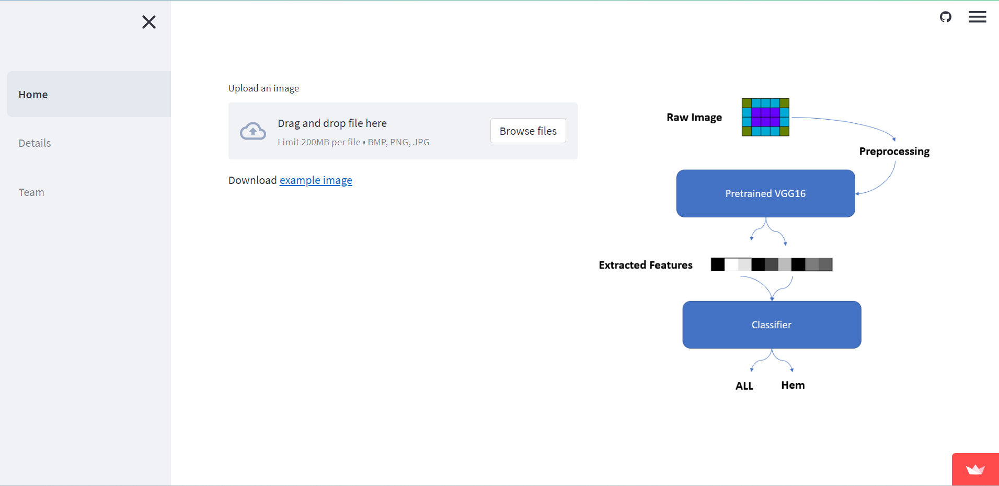

# Detecting Pediatric Acute Lymphoblastic Leukemia using Computer Vision

This is a collaborative open source project promoted by Omdena Liverpool Chapter.

Acute Lymphoblastic Leukemia (ALL) is the only form of leukemia that is more common in children than adults. It is the single most common form of pediatric cancer, accounting for about one-third of all cases in children. About 85% of cases of childhood leukemia are ALL and it occurs in about 400 children in the UK each year. 

The task of identifying immature leukemic blasts from normal cells under the microscope is challenging due to morphological similarity, this can make the diagnosis time consuming and costly.  

Project detailed description: https://omdena.com/chapter-challenges/detecting-pediatric-acute-lymphoblastic-leukemia-using-computer-vision/

## Objectives

The goal of the project is to build a model which will make early identification of paediatric ALL quick and cost effective – this will allow early treatment to be sought and potentially save the lives of those who are afflicted.

In more specific terms, them objective is to train machine learning and deep learning models for automatic identifiction/classification of healthy cels (hem) and cancer cells (all).

## Datasets

ALL Challenge dataset of ISBI 2019 (C-NMC 2019)

https://wiki.cancerimagingarchive.net/pages/viewpage.action?pageId=52758223

Challenge is split into 3 separate phases:

### Train set composition:

- Total subjects: 73, ALL (cancer): 47, Normal: 26

- Total cell images: 10,661, ALL(cancer): 7272, Normal: 3389

### Preliminary test set composition:

- Total subjects: 28, ALL (cancer): 13, Normal: 15

- Total cell images: 1867, ALL(cancer): 1219, Normal: 648

### Final test set composition:

- Total subjects: 17, ALL (cancer): 9, Normal: 8

- Total cell images: 2586

## Modeling Approach

*Image credits by: Owais Thair*

## Classification Results

*Image credits by: Project Team Results*

*Image credits by: Project Team Results*

## Project GitHub Folder

https://github.com/OmdenaAI/liverpool-chapter-detecting-pediatric-acute

## Project WebApp Deployed

https://liskibruh-omdena-liverpool-predicting-all-dashboard-home-1318ne.streamlit.app/

